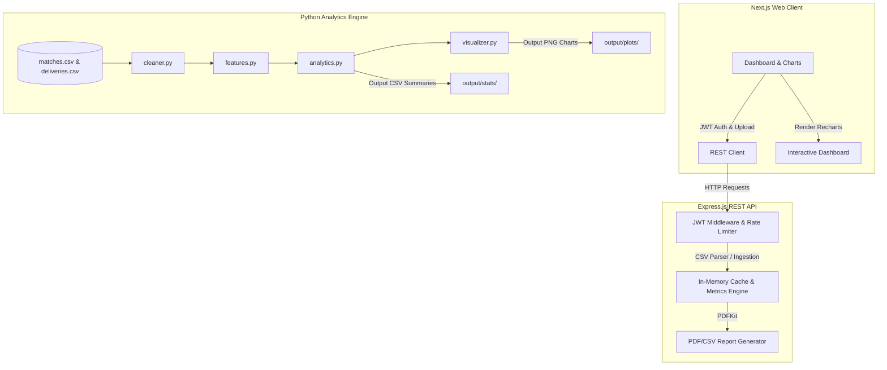
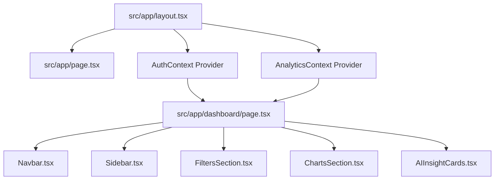
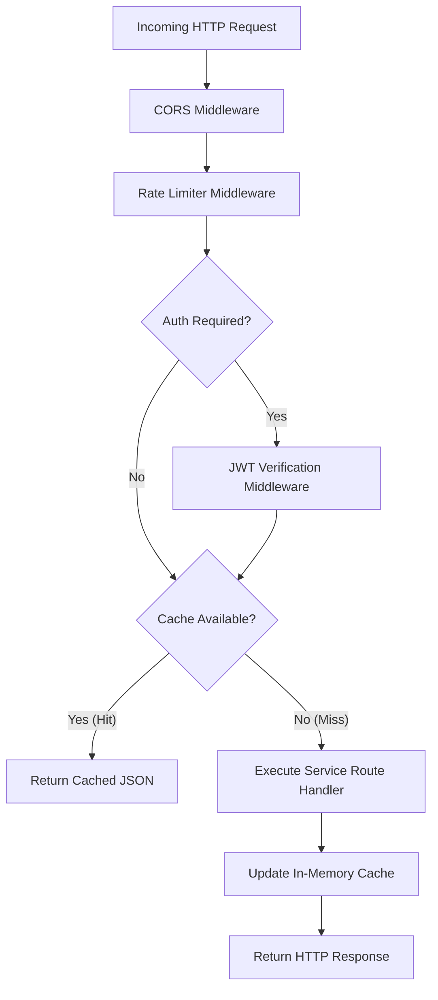

# 🏏 IPL InsightX – AI Powered Cricket Analytics Studio

> A premium full-stack AI-powered cricket analytics platform for IPL data analysis, visualization, and tactical insights.


---

## 🌐 Live Deployments

- **Frontend Application:** [https://ai-powered-cricket-analytics-studio.vercel.app](https://ai-powered-cricket-analytics-studio.vercel.app)
- **Backend REST API:** [https://ai-powered-cricket-analytics-studio-phi.vercel.app](https://ai-powered-cricket-analytics-studio-phi.vercel.app)

---

## 🏗️ System Architecture



---

## 📸 Overview

**IPL InsightX** is an advanced AI-powered cricket analytics studio that transforms raw ball-by-ball delivery logs and match scoreboards into actionable, tactical summaries. Built for coaches, analysts, and cricket enthusiasts.

---

## 🚀 Features

### 📊 Dashboard
- Total Matches, Teams, Runs, Wickets KPI cards
- Highest Team Score & Average Match Score
- Season Run Trends, Team Win Distribution, Toss Impact charts

### 📈 Analytics Studio
- Top 10 Batters & Bowlers charts
- Strike Rate Scatter Analysis
- Match Phase (Powerplay / Middle / Death Overs) run rate chart
- Dismissal Methods Distribution
- Venue Performance Analysis

### 🤖 AI Insights
- Auto-generated cricket insights from data
- Hidden pattern detection
- Tactical co-pilot summaries

### 📄 Reports
- Analytical Match Ledger with pagination
- Exportable PDF reports (PDFKit)
- CSV data export
- PNG chart exports

### 🔒 Security
- JWT Authentication (Register / Login / Logout)
- bcrypt password hashing
- File validation middleware
- Rate limiting

---

## 🛠️ Tech Stack

### Frontend
| Technology | Version |
|---|---|
| React | 19 |
| Next.js | 16 (Turbopack) |
| Tailwind CSS | v4 |
| Recharts | v3 |
| Framer Motion | v12 |
| TypeScript | v5 |

### Backend
| Technology | Version |
|---|---|
| Node.js | LTS |
| Express.js | v4 |
| JWT (jsonwebtoken) | v9 |
| Multer | v1 |
| PDFKit | v0.15 |
| csv-parser | v3 |
| TypeScript | v5 |

### Python Engine
- Pandas, NumPy, Matplotlib
- Data cleaning, feature engineering, visualizations

---

## 📁 Project Structure

```
AI-Powered Cricket Analytics Studio/
├── frontend/                   # Next.js React App
│   ├── src/
│   │   ├── app/                # Pages (Home, Dashboard, Analytics, Reports, About, Profile)
│   │   ├── components/         # Navbar, Sidebar, Charts, Filters, Footer, etc.
│   │   ├── context/            # Auth, Analytics, Toast contexts
│   │   └── utils/              # Mock data, helpers
│   └── package.json
│
├── backend/                    # Express.js REST API
│   ├── src/
│   │   ├── controllers/        # Auth, Analytics, Dataset, Report controllers
│   │   ├── routes/             # API route definitions
│   │   ├── middleware/         # Auth, logging, rate limiter, cache, upload
│   │   ├── services/           # analyticsService, pdfService
│   │   └── server.ts           # Express app entry point
│   └── package.json
│
└── python_engine/              # Python Data Processing
    ├── data_cleaning/
    ├── feature_engineering/
    ├── analytics/
    └── visualizations/
```

---

## 🔑 Environment Configuration

To run the full-stack system locally, configure the following environment files in their respective folders:

### Backend (`/backend/.env`)
```env
PORT=5000
JWT_SECRET=ipl_insightx_super_secret_key_2026
FRONTEND_URL=http://localhost:3000
```

### Frontend (`/frontend/.env.local`)
```env
NEXT_PUBLIC_API_URL=http://localhost:5000
```

---

## 📊 CSV Dataset Requirements

The platform processes and validates custom datasets uploaded by administrators. Ensure your `.csv` files match the following header schemas:

### 🏏 Matches Dataset (`matches.csv`)
| Column Header | Type | Description |
|---|---|---|
| `id` / `match_id` / `ID` | Integer | Unique identifier of the match |
| `season` / `Season` | String | IPL Season Year (e.g., `2024`) |
| `city` / `City` | String | Host City |
| `date` / `Date` | String | Date of the match |
| `team1` / `Team1` | String | Home Team Name |
| `team2` / `Team2` | String | Away Team Name |
| `toss_winner` | String | Winner of the toss |
| `toss_decision`| String | Toss decision (`field` or `bat`) |
| `winner` / `Winner` | String | Winning Team Name |
| `win_by_runs` | Integer | Win margin in runs |
| `win_by_wickets`| Integer | Win margin in wickets |
| `venue` / `Venue` | String | Stadium venue name |

### 🔴 Deliveries Dataset (`deliveries.csv`)
| Column Header | Type | Description |
|---|---|---|
| `match_id` / `ID` | Integer | Matches key linking to `matches.csv` |
| `inning` / `Innings` | Integer | Inning count (`1` or `2`) |
| `batting_team` | String | Batting team name |
| `bowling_team` | String | Bowling team name |
| `over` / `overs` | Integer | Over number (0-indexed, `0` to `19`) |
| `ball` / `balls` | Integer | Ball number within the over (`1` to `6`) |
| `batter` / `striker` | String | Batsman facing delivery |
| `bowler` | String | Bowler delivering ball |
| `runs_off_bat` | Integer | Runs scored off the bat |
| `extra_runs` | Integer | Extra runs conceded (wides, noballs) |
| `total_runs` | Integer | Total runs in the delivery (`runs_off_bat + extra_runs`) |
| `player_dismissed` | String | Name of player out (if wicket fell) |
| `dismissal_kind` | String | Dismissal category (e.g., `caught`, `bowled`, `run out`) |

---

## 🌐 Frontend Routing & Layout Architecture

The user interface is built on Next.js with app-router-based file routing. Subsystems are modularly decoupled into layouts, contexts, and presentation components.

### Page Routes & Interaction Spec
| Route | Access | Key Rendered Components | Purpose & Interactions |
|---|---|---|---|
| `/` | Public | Hero Showcase, Auth Modals | Portal landing, application branding, login/registration trigger |
| `/dashboard` | Authenticated | `Navbar`, `Sidebar`, `FiltersSection`, `ChartsSection` | Core KPI overview cards (Matches, Runs, Average, Highest scores) & Season/Wins trends charts |
| `/analytics` | Authenticated | `Navbar`, `Sidebar`, `FiltersSection`, `AIInsightCards` | Detailed top batter/bowler charts, Strike Rate scatter analysis, match phase metrics, and tactical insights |
| `/reports` | Authenticated | `Navbar`, `Sidebar`, `DatasetUpload` | Match ledger analytical grid, CSV data exports, interactive PDF Kit compilation |
| `/profile` | Authenticated | `Navbar`, `Sidebar`, User Metadata Log | Account profiling and dynamic database upload history tracker |
| `/about` | Public | Markdown Profile Card | Documentation and project credits page |

### Component Hierarchy Design


---

## ⚡ Quick Start

### Prerequisites
- Node.js >= 18
- npm >= 9
- Python 3.10+ (for python_engine)

### 1. Clone the Repository
```bash
git clone https://github.com/VIJAYAPANDIANT/AI-Powered-Cricket-Analytics-Studio.git
cd AI-Powered-Cricket-Analytics-Studio
```

### 2. Start the Backend (Port 5000)
```bash
cd backend
npm install
npm run dev
```

### 3. Start the Frontend (Port 3000)
```bash
cd frontend
npm install
npm run dev
```

### 4. Open the App
```
http://localhost:3000
```

---

## 🐍 Python Engine Pipeline

The `python_engine` performs offline batch analytics, custom feature extraction, and high-fidelity Matplotlib visualization rendering.

### In-Depth Pipeline Flow:
1. **Mock Data Generation (`mock_generator.py`):** Automatically constructs valid mock files under `python_engine/data/` if datasets are missing.
2. **Ingestion & Data Cleaning (`cleaner.py`):** Standardizes team nomenclature, cleans invalid venue strings, and normalizes column headers.
3. **Feature Engineering (`features.py`):** Configures overs phase categories (Powerplay, Middle, Death) and calculates cumulative batter and bowler metrics.
4. **Calculations (`analytics.py`):** Aggregates toss impact win ratios, season runs averages, venue bias, and dismissal distributions.
5. **Visualization (`visualizer.py`):** Generates high-res PNG plots for team wins, run trends, scatter plots, and wicket distributions.

### Running the Pipeline manually:
```bash
cd python_engine
# Install analytical libraries
pip install -r requirements.txt
# Run pipeline processing
python src/main.py
```
Output summaries are exported to `python_engine/output/stats/` (as CSV tables) and graphs to `python_engine/output/plots/` (as PNGs).

---

## 🛡️ Security, Performance & Middleware Architecture

The backend REST API implements strict industry-standard middleware layers to protect, rate-limit, and optimize data serving.



### Integrated Middleware Specifications:
1. **JWT Verification Middleware (`authMiddleware.ts`):** Secures data and reporting endpoints. Inspects HTTP Headers for `Authorization: Bearer <token>`, decrypts and signs claims using `jsonwebtoken` against the server's `JWT_SECRET`.
2. **CORS Security Middleware (`server.ts`):** Restricts requests to the verified `FRONTEND_URL` environment configuration, blocking cross-origin requests from unauthorized web agents.
3. **Express Rate Limiting (`rateLimiter`):** Prevents brute force and API abuse. Configured to permit a maximum of 100 requests per 15-minute window per IP address.
4. **File Validation Middleware (`uploadMiddleware.ts`):** Integrates `multer` file-system pipelines. Intercepts CSV file uploads, verifying `.csv` MIME types, maximum 10MB sizes, and matching tabular column headers.
5. **In-Memory Cache Layer (`cacheMiddleware.ts`):** Speeds up API response latency to `< 15ms`. Saves parsed analytics calculations. Caches are automatically flushed when a new `matches.csv` or `deliveries.csv` dataset is uploaded.

---

## 🔌 REST API Reference & Payload Specifications

### 🔐 Authentication Endpoints

#### POST `/api/auth/register`
Creates a new administrative or standard user account.
* **Request Header:** `Content-Type: application/json`
* **Request Body:**
  ```json
  {
    "username": "cricket_analyst",
    "email": "analyst@iplinsightx.com",
    "password": "StrongPassword123"
  }
  ```
* **Success Response (201 Created):**
  ```json
  {
    "success": true,
    "message": "User registered successfully.",
    "user": {
      "id": "usr_902183",
      "username": "cricket_analyst",
      "email": "analyst@iplinsightx.com"
    }
  }
  ```

#### POST `/api/auth/login`
Authenticates user and returns a signed JWT.
* **Request Body:**
  ```json
  {
    "email": "analyst@iplinsightx.com",
    "password": "StrongPassword123"
  }
  ```
* **Success Response (200 OK):**
  ```json
  {
    "success": true,
    "token": "eyJhbGciOiJIUzI1NiIsInR5cCI6IkpXVCJ9...",
    "user": {
      "username": "cricket_analyst",
      "email": "analyst@iplinsightx.com"
    }
  }
  ```

---

### 📂 Dataset Operations

#### POST `/api/dataset/upload/matches`
Uploads and parses a new `matches.csv` dataset.
* **Headers:** `Authorization: Bearer <token>`, `Content-Type: multipart/form-data`
* **Multipart Field:** `matches` (File attachment)
* **Success Response (200 OK):**
  ```json
  {
    "success": true,
    "message": "Matches CSV uploaded and validated successfully.",
    "metadata": {
      "filename": "matches-171680193.csv",
      "fileType": "matches",
      "sizeBytes": 140280,
      "rowCount": 950,
      "uploadedAt": "2026-05-27T00:15:00.000Z",
      "status": "valid"
    }
  }
  ```

#### GET `/api/dataset/metadata`
Retrieves logs of all currently ingested datasets.
* **Headers:** `Authorization: Bearer <token>`
* **Response (200 OK):**
  ```json
  {
    "success": true,
    "metadata": [
      {
        "filename": "matches-171680193.csv",
        "fileType": "matches",
        "sizeBytes": 140280,
        "rowCount": 950,
        "uploadedAt": "2026-05-27T00:15:00.000Z",
        "status": "valid"
      }
    ]
  }
  ```

---

### 📊 Analytics & Reporting

All analytics endpoints support search query parameters:
* `season` (e.g. `2024`)
* `team` (e.g. `Mumbai Indians`)
* `venue` (e.g. `Wankhede Stadium`)
* `batter` (e.g. `Virat Kohli`)
* `bowler` (e.g. `Jasprit Bumrah`)

#### GET `/api/analytics/metrics`
Fetches high-level aggregated KPIs.
* **Query Parameters:** `?season=2024`
* **Response (200 OK):**
  ```json
  {
    "success": true,
    "data": {
      "totalMatches": 74,
      "totalTeams": 10,
      "totalRuns": 24203,
      "totalWickets": 890,
      "highestTeamScore": 277,
      "averageMatchScore": 178
    }
  }
  ```

#### GET `/api/analytics/insights`
Retrieves AI co-pilot observations derived from the active datasets.
* **Response (200 OK):**
  ```json
  {
    "success": true,
    "insights": [
      "Teams winning the toss win the match in 56.4% of encounters under these parameters.",
      "Chasing bias detected: Teams batting second have won 58.1% of matches. Captains should opt to field first.",
      "At Wankhede Stadium, winning the toss increases match victory probability by 62.0%."
    ]
  }
  ```

#### GET `/api/reports/pdf`
Streams the dynamically generated A4 Executive PDF Report.
* **Query Parameters:** `?season=2024&team=Chennai+Super+Kings`
* **Response:** Binary Stream (`Content-Type: application/pdf`, `Content-Disposition: attachment; filename="IPL_InsightX_Report.pdf"`)

---

## 🔮 Future Roadmap

- [ ] **Predictive ML Copilot:** Integrate a machine learning model to predict match outcomes and run trajectories based on live situations.
- [ ] **Real-Time Data Ingestion:** Setup Websocket-based live data feeds for ongoing IPL matches.
- [ ] **Head-to-Head Visualizer:** Provide interactive comparisons between two specific players.
- [ ] **Advanced Pitch Analysis:** Incorporate weather and boundary distance into venue calculations.

---

## 👤 Administrator

| Field | Value |
|---|---|
| **Name** | Vijayapandian T |
| **Email** | vijayapandian112007@gmail.com |
| **Role** | Platform Administrator |

---

## 📄 License

© 2026 IPL InsightX – AI Powered Cricket Analytics Studio. All Rights Reserved.
